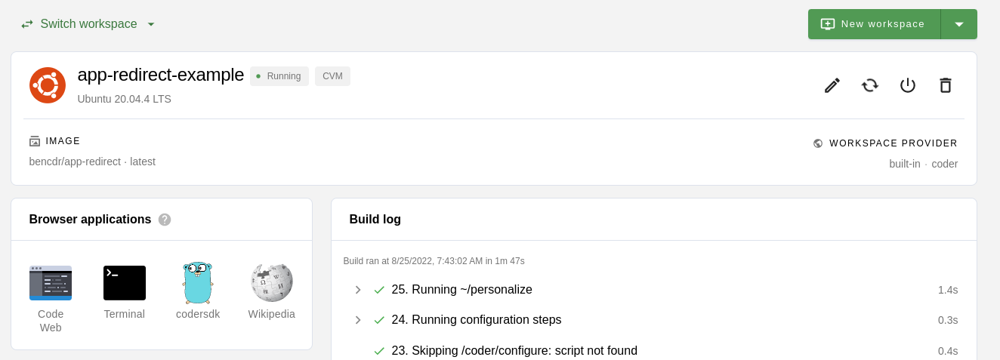

# coder-app-redirects

An example with Coder apps that redirect to arbitrary external URLs via a simple [python redirect server](./.coder/img/coder/apps/redirect.py):

Try the image in DockerHub: `bencdr/app-example:latest` or [view the code](./coder/img)

